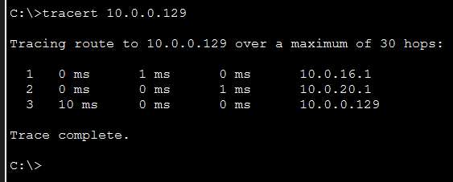

<div align="center">


# Final Project Komunikasi Data dan Jaringan Komputer

## Infrastruktur Jaringan Yayasan ARA


### Link Dokumentasi

| Dokumen | Link |
|---------|------|
| Dokumentasi | [Google Docs](https://docs.google.com/document/d/1vzgQBBy7D44LklCiM8M_3jEiCXpu29Ajk__K2E77n_0/edit?tab=t.0) |
| Subnet IP (Excel) | [Google Sheets](https://docs.google.com/spreadsheets/d/1ljFQ8uKEsNKY6sePCemqMiQss0rdTDq-U2jptAffsI8/edit?gid=0#gid=0) |
| Tree VLSM | [Excalidraw](https://excalidraw.com/#room=f4c80a937ed0d8432c67,PnPCWbaQLfkJVZ3lP-Xi2g) |
| Tree CIDR | [Excalidraw](https://excalidraw.com/#room=15a49b8dc2d76691ae77,sKO80xs6elu_ihL0nUN-Qg) |

</div>

---

<div align="center">

### Disusun Oleh

| Nama | NRP |
|------|-----|
| Arya Bisma Putra Refman | 5027241036 |
| Ahmad Yazid Arifuddin | 5027241040 |
| Naila Cahyarani Idelia | 5027241063 |

**Teknologi Informasi**  
**Institut Teknologi Sepuluh Nopember**  
**Surabaya, 12 Desember 2025**

</div>

---

## Daftar Isi

- [1. Topologi Jaringan](#1-topologi-jaringan)
- [2. Subnetting Gedung Utama - VLSM](#2-subnetting-gedung-utama---vlsm)
- [3. Subnetting Gedung ARA Tech - CIDR](#3-subnetting-gedung-ara-tech---cidr)
- [4. Konfigurasi IP & DHCP](#4-konfigurasi-ip--dhcp)
- [5. Routing Strategy](#5-routing-strategy)
- [6. NAT Overload / PAT](#6-nat-overload--pat)
- [7. GRE Tunnel](#7-gre-tunnel)
- [8. Kesimpulan](#8-kesimpulan)

---

## 1. Topologi Jaringan

### 1.1. Topologi


Topologi jaringan di atas menggambarkan infrastruktur lengkap Yayasan ARA yang terdiri dari tiga lokasi: **Gedung Utama** (kiri), **Gedung ARA Tech** (tengah), dan **Kantor Cabang** (kanan). Router Utama di bagian atas berperan sebagai backbone yang menghubungkan semua lokasi dan menyediakan akses ke internet melalui cloud. Setiap gedung memiliki router dedicated yang terhubung ke switch di setiap lantai. Gedung ARA Tech memiliki 4 lantai dengan masing-masing switch per lantai, sementara Gedung Utama dan Kantor Cabang memiliki struktur yang lebih sederhana dengan switch dan end devices berupa PC dan server.

### 1.2. Deskripsi

Topologi jaringan yang diimplementasikan untuk Yayasan ARA menggunakan kombinasi beberapa jenis topologi:

| Jenis Topologi | Deskripsi | Implementasi |
|----------------|-----------|--------------|
| **Topologi Star** | Banyak device terhubung ke switch pusat | Setiap lantai memiliki switch yang menghubungkan semua perangkat |
| **Topologi Hierarchical** | Tersusun berlapis dari atas ke bawah | Router Pusat - Router Gedung Utama & Router Kantor Cabang |
| **Redundant Links** | Jalur cadangan antar switch | Switch Lantai 1 - Switch IT Department Lantai 1 |

**Keunggulan Desain:**
- High Availability - Sistem tetap berjalan meski ada komponen gagal
- Fault Tolerance - Jika satu jalur putus, ada jalur alternatif
- Scalability - Mudah menambah perangkat baru
- Manageability - Mudah troubleshooting dan maintenance

---

## 2. Subnetting Gedung Utama - VLSM

### 2.1. Kebutuhan Host per Unit

Gedung Utama Yayasan ARA memiliki 6 unit kerja dengan kebutuhan host sebagai berikut:

| No | Unit | Kebutuhan Host | Keterangan |
|----|------|----------------|------------|
| 1 | Unit SDM Pendidikan | 95 | Workstation |
| 2 | Unit Kurikulum & Penjaminan Mutu | 220 | Workstation |
| 3 | Unit Sarana Prasarana | 45 | Workstation |
| 4 | Unit Pembinaan & Pengawasan Sekolah | 18 | Workstation |
| 5 | Unit IT Pendidikan | 6 | Server |
| 6 | Unit Layanan Operasional Yayasan | 380 | Workstation |
| | **Total** | **764** | |

### 2.2. Penjelasan Perhitungan VLSM

**VLSM (Variable Length Subnet Masking)** adalah teknik subnetting yang memungkinkan penggunaan subnet mask berbeda untuk setiap subnet, sehingga alokasi IP lebih efisien.

#### Keputusan Desain: Penggabungan 6 Unit dalam 1 Subnet

Dalam implementasi ini, seluruh unit di Gedung Utama digabungkan dalam **satu subnet besar (A1)** dengan pertimbangan sebagai berikut:

| Alasan | Penjelasan |
|--------|------------|
| **Kesederhanaan Manajemen** | Dengan satu subnet, administrator hanya perlu mengelola satu DHCP pool dan satu gateway, mengurangi kompleksitas konfigurasi dan troubleshooting |
| **Efisiensi Routing** | Satu subnet berarti satu entry routing table, mengurangi overhead pada router dan mempercepat proses routing lookup |
| **Fleksibilitas Alokasi IP** | Semua unit dapat saling berbagi pool IP yang sama, memudahkan realokasi jika ada unit yang berkembang atau menyusut |
| **Komunikasi Intra-Gedung** | Semua perangkat dalam gedung berada di broadcast domain yang sama, memungkinkan komunikasi langsung tanpa melewati router |
| **Skalabilitas** | Kapasitas 1022 host dengan cadangan 20% memberikan ruang pertumbuhan yang cukup untuk ekspansi di masa depan |

**Alternatif yang tidak dipilih:** Membuat 6 subnet terpisah untuk setiap unit akan memerlukan router/layer-3 switch untuk komunikasi antar unit, menambah latency dan kompleksitas.

**Perhitungan:**
- Kebutuhan: 764 host
- Cadangan 20%: 764 × 1.2 = 917 host
- Subnet /22 = 2^(32-22) - 2 = 1022 usable host (memenuhi kebutuhan)

#### Tabel Subnetting VLSM:

| Subnet | Deskripsi | Kebutuhan (+20%) | Kapasitas Host | Mask | Network ID | Broadcast | Range IP |
|--------|-----------|------------------|----------------|------|------------|-----------|----------|
| A1 | LAN Gedung Utama | 917 | 1022 | /22 | 10.0.16.0 | 10.0.19.255 | 10.0.16.1 - 10.0.19.254 |
| A2 | Link ke Router Utama | 2 | 2 | /30 | 10.0.20.0 | 10.0.20.3 | 10.0.20.1 - 10.0.20.2 |

### 2.3. Perhitungan VLSM


Tabel di atas menunjukkan hasil perhitungan VLSM untuk Gedung Utama. Subnet A1 dengan prefix /22 menampung seluruh 764 host dari 6 unit kerja dengan cadangan 20% untuk skalabilitas. Subnet A2 dengan prefix /30 digunakan untuk link point-to-point antara Router Gedung Utama dan Router Utama.

### 2.4. Tree VLSM


Diagram tree di atas menggambarkan pembagian subnet VLSM secara hierarki. Dimulai dari network utama yang kemudian dipecah menjadi subnet-subnet sesuai kebutuhan host masing-masing unit.

### 2.5. Konfigurasi Interface Router Gedung Utama


Output `show ip interface brief` pada Router Gedung Utama menampilkan status interface:
- **FastEthernet0/0**: IP 10.0.20.2/30 - terhubung ke Router Utama (status up)
- **FastEthernet0/1**: IP 10.0.16.1/22 - gateway untuk jaringan LAN Gedung Utama (status up)
- **Tunnel0**: IP 192.168.100.1/30 - interface GRE tunnel (status up)

### 2.6. Subnetting Kantor Cabang

Kantor Cabang memiliki 1 unit kerja:

| Unit | Kebutuhan Host | Kebutuhan (+20%) |
|------|----------------|------------------|
| Regional Office | 40 | 48 |

#### Tabel Subnetting Kantor Cabang:

| Subnet | Kebutuhan (+20%) | Kapasitas Host | Mask | Network ID | Broadcast | Range IP |
|--------|------------------|----------------|------|------------|-----------|----------|
| A3 | 48 | 62 | /26 | 10.0.12.64 | 10.0.12.127 | 10.0.12.65 - 10.0.12.126 |

Subnet /26 memberikan kapasitas 62 usable host, cukup untuk 40 host dengan cadangan 20% (48 host).

---

## 3. Subnetting Gedung ARA Tech - CIDR

### 3.1. Kebutuhan Host per Departemen

Gedung ARA Tech memiliki 5 lantai dengan 14 departemen:

| Lantai | Departemen | Kebutuhan Host | Keterangan |
|--------|------------|----------------|------------|
| **Lantai 1** | Departemen IT Support | 45 | Workstation |
| | Ruang Server & Data Center | 12 | Server |
| | Departemen Cybersecurity | 22 | 2 Server |
| **Lantai 2** | Departemen Marketing | 35 | Workstation |
| | Departemen Sales | 25 | Workstation |
| | Departemen Human Resources | 25 | Workstation |
| **Lantai 3** | Departemen R&D | 55 | 5 Server |
| | Departemen People Development | 18 | Workstation |
| **Lantai 4** | Departemen Keuangan | 28 | Workstation |
| | Departemen Legal | 18 | Workstation |
| | Departemen Customer Service | 40 | Workstation |
| **Lantai 5** | Executive Office | 12 | Workstation |
| | Guest Lounge | 10 | Workstation |
| | Auditorium | 15 | Workstation |

### 3.2. Penjelasan Perhitungan CIDR

**CIDR (Classless Inter-Domain Routing)** memungkinkan penggunaan prefix length yang fleksibel dan penggabungan subnet (supernetting) untuk menyederhanakan routing table.

#### Keputusan Desain: Subnet Terpisah per Lantai

Berbeda dengan Gedung Utama, Gedung ARA Tech menggunakan **subnet terpisah untuk setiap lantai** dengan pertimbangan:

| Alasan | Penjelasan |
|--------|------------|
| **Isolasi Departemen** | Setiap lantai memiliki fungsi berbeda (IT, Marketing, R&D, dll). Subnet terpisah memudahkan penerapan policy dan access control per departemen |
| **Keamanan** | Data Center dan Cybersecurity di Lantai 1 perlu isolasi dari traffic lantai lain. Subnet terpisah memungkinkan firewall rules yang lebih granular |
| **Manajemen Traffic** | Broadcast traffic terbatas pada masing-masing lantai, mengurangi congestion dan meningkatkan performa jaringan |
| **Troubleshooting** | Masalah di satu lantai tidak mempengaruhi lantai lain. Lebih mudah mengisolasi dan memperbaiki masalah |
| **Skalabilitas Independen** | Setiap lantai dapat berkembang secara independen tanpa mempengaruhi alokasi IP lantai lain |

**Mengapa berbeda dengan Gedung Utama?**
- Gedung Utama: Semua unit berada dalam 1 gedung dengan kebutuhan komunikasi yang intensif antar unit
- Gedung ARA Tech: Lebih berorientasi departemen dengan kebutuhan keamanan dan isolasi yang lebih tinggi, terutama untuk Data Center

#### Tabel Subnet per Lantai (A1-A11):

| Subnet | Network ID | Netmask | Broadcast | Range IP Host |
|--------|------------|---------|-----------|---------------|
| A1 | 10.0.0.0/25 | 255.255.255.128 | 10.0.0.127 | 10.0.0.1 - 10.0.0.126 |
| A2 | 10.0.4.0/25 | 255.255.255.128 | 10.0.4.127 | 10.0.4.1 - 10.0.4.126 |
| A3 | 10.0.5.0/25 | 255.255.255.128 | 10.0.5.127 | 10.0.5.1 - 10.0.5.126 |
| A4 | 10.0.6.0/25 | 255.255.255.128 | 10.0.6.127 | 10.0.6.1 - 10.0.6.126 |
| A5 | 10.0.7.0/26 | 255.255.255.192 | 10.0.7.63 | 10.0.7.1 - 10.0.7.62 |
| A6 | 10.0.0.128/30 | 255.255.255.252 | 10.0.0.131 | 10.0.0.129 - 10.0.0.130 |
| A7 | 10.0.4.128/30 | 255.255.255.252 | 10.0.4.131 | 10.0.4.129 - 10.0.4.130 |
| A8 | 10.0.5.128/30 | 255.255.255.252 | 10.0.5.131 | 10.0.5.129 - 10.0.5.130 |
| A9 | 10.0.6.128/30 | 255.255.255.252 | 10.0.6.131 | 10.0.6.129 - 10.0.6.130 |
| A10 | 10.0.7.128/30 | 255.255.255.252 | 10.0.7.131 | 10.0.7.129 - 10.0.7.130 |
| A11 | 10.0.8.0/30 | 255.255.255.252 | 10.0.8.3 | 10.0.8.1 - 10.0.8.2 |

**Keterangan:**
- A1-A5: Subnet LAN untuk setiap lantai (menggunakan /25 atau /26 sesuai kebutuhan host)
- A6-A10: Subnet link point-to-point antar router per lantai (/30 untuk efisiensi IP)
- A11: Link ke Router Utama

### 3.3. Penggabungan Subnet (Supernetting)

#### Mengapa Perlu Supernetting?

Meskipun kita memiliki 11 subnet terpisah untuk Gedung ARA Tech, akan sangat tidak efisien jika Router Utama harus menyimpan 11 entry routing table terpisah. Supernetting dilakukan untuk:

| Alasan | Penjelasan |
|--------|------------|
| **Mengurangi Routing Table Size** | 11 subnet → 1 supernet = 10 entry lebih sedikit di Router Utama |
| **Mempercepat Routing Lookup** | Semakin kecil routing table, semakin cepat proses pencarian route |
| **Menyederhanakan Konfigurasi** | Cukup satu network statement di OSPF untuk advertise seluruh ARA Tech |
| **Mengurangi Routing Updates** | Perubahan di subnet internal tidak perlu di-advertise keluar |

Proses supernetting dilakukan secara bertahap dengan menggabungkan subnet-subnet yang bertetangga (contiguous):

#### Tahap I - Penggabungan LAN + Link per Lantai:

| Subnet | Gabungan 1 | Netmask | Gabungan 2 | Netmask | Netmask Akhir |
|--------|------------|---------|------------|---------|---------------|
| B1 | A1 | /25 | A6 | /30 | /24 |
| B2 | A2 | /25 | A7 | /30 | /24 |
| B3 | A3 | /25 | A8 | /30 | /24 |
| B4 | A4 | /25 | A9 | /30 | /24 |
| B5 | A5 | /26 | A10 | /30 | /25 |

#### Tahap II - Penggabungan Antar Lantai:

| Subnet | Gabungan 1 | Netmask | Gabungan 2 | Netmask | Netmask Akhir |
|--------|------------|---------|------------|---------|---------------|
| C1 | B2 | /24 | B3 | /24 | /23 |
| C2 | B4 | /24 | B5 | /25 | /23 |

#### Tahap III - Penggabungan Lanjutan:

| Subnet | Gabungan 1 | Netmask | Gabungan 2 | Netmask | Netmask Akhir |
|--------|------------|---------|------------|---------|---------------|
| D1 | C1 | /23 | C2 | /23 | /22 |

#### Tahap IV - Agregasi dengan Lantai 1:

| Subnet | Gabungan 1 | Netmask | Gabungan 2 | Netmask | Netmask Akhir |
|--------|------------|---------|------------|---------|---------------|
| E1 | B1 | /24 | D1 | /22 | /21 |

#### Tahap V - Agregasi Final dengan Link Utama:

| Subnet | Gabungan 1 | Netmask | Gabungan 2 | Netmask | Netmask Akhir |
|--------|------------|---------|------------|---------|---------------|
| F1 | A11 | /30 | E1 | /21 | /20 |

**Hasil Akhir:** Seluruh jaringan Gedung ARA Tech dapat direpresentasikan dengan satu supernet **10.0.0.0/20** untuk routing advertisement ke Router Utama. Dengan satu entry ini, Router Utama dapat menjangkau semua 11 subnet internal ARA Tech.

### 3.4. Perhitungan CIDR


Tabel perhitungan CIDR menunjukkan detail alokasi IP untuk seluruh 11 subnet di Gedung ARA Tech. Proses supernetting menghasilkan agregasi dari /25, /26, /30 menjadi satu blok /20 yang menyederhanakan routing table.

### 3.5. Tree CIDR


Diagram tree di atas menggambarkan proses supernetting secara visual. Subnet-subnet kecil (A1-A11) digabungkan secara bertahap hingga membentuk satu supernet /20 yang merepresentasikan seluruh jaringan Gedung ARA Tech.

### 3.6. Konfigurasi Interface Router ARA Tech


Output `show ip interface brief` pada Router ARA Tech menampilkan interface aktif:
- **FastEthernet1/0**: 10.0.0.129 - gateway Lantai 1
- **FastEthernet2/0**: 10.0.4.129 - gateway Lantai 2
- **FastEthernet3/0**: 10.0.5.129 - gateway Lantai 3
- **FastEthernet4/0**: 10.0.6.129 - gateway Lantai 4
- **FastEthernet5/0**: 10.0.8.2 - link ke Router Utama

Semua interface dalam status up/up menandakan konektivitas berjalan normal.

---

## 4. Konfigurasi IP & DHCP

### 4.1. DHCP Gedung Utama

.png)

Konfigurasi DHCP pada Router Gedung Utama menggunakan pool bernama "GEDUNG_UTAMA" dengan parameter:
- **Network**: 10.0.16.0/22
- **Default Router**: 10.0.16.1
- **DNS Server**: 8.8.8.8

Excluded address dikonfigurasi untuk range 10.0.16.1 - 10.0.16.10 agar IP tersebut tidak diberikan ke client (reserved untuk gateway dan server).

### 4.2. IP Static Server Gedung Utama


Tampilan IP Configuration pada Server Gedung Utama menunjukkan konfigurasi static:
- **IP Address**: 10.0.16.2
- **Subnet Mask**: 255.255.252.0
- **Default Gateway**: 10.0.16.1
- **DNS Server**: 8.8.8.8

Server menggunakan IP static untuk memastikan alamat tidak berubah sehingga dapat diakses secara konsisten oleh client.

### 4.3. DHCP Kantor Cabang

.png)

Konfigurasi DHCP pada Router Kantor Cabang dengan pool "KANTOR_CABANG":
- **Network**: 10.0.12.0/30
- **Default Router**: 10.0.12.1
- **DNS Server**: 8.8.8.8

Pool ini melayani client di Kantor Cabang dengan alokasi IP otomatis.

### 4.4. Bukti PC Mendapat IP dari DHCP


Tampilan IP Configuration pada PC client menunjukkan mode DHCP aktif dengan IP yang diperoleh secara otomatis:
- **IP Address**: Diperoleh dari DHCP pool
- **Subnet Mask**: Sesuai konfigurasi pool
- **Default Gateway**: Sesuai parameter default-router
- **DNS Server**: 8.8.8.8

Tombol DHCP dalam keadaan selected menandakan PC menggunakan pengalamatan dinamis.

---

## 5. Routing Strategy

### 5.1. Strategi Routing yang Dipilih

Implementasi menggunakan **kombinasi Static Routing dan Dynamic Routing (OSPF)** dengan pembagian berikut:

| Routing Type | Digunakan Untuk | Alasan |
|--------------|-----------------|--------|
| **Static Routing** | Default route ke internet (0.0.0.0/0) | Internet gateway tidak berubah, static lebih sederhana dan stabil |
| **OSPF** | Koneksi antar Gedung Utama, ARA Tech, dan Kantor Cabang | Topologi kompleks dengan multiple path, OSPF otomatis menghitung best path dan failover |

**Mengapa tidak menggunakan Static Routing saja?**
- Dengan 3 gedung dan banyak subnet, static routing memerlukan konfigurasi manual di setiap router
- Jika ada perubahan topologi (link down), static route tidak dapat beradaptasi otomatis
- Maintenance menjadi sulit karena harus update konfigurasi di semua router

**Mengapa OSPF dipilih daripada EIGRP?**
- OSPF adalah open standard (RFC 2328), dapat digunakan di multi-vendor environment
- OSPF menggunakan link-state yang lebih efisien untuk jaringan besar
- Memiliki konvergensi cepat dengan SPF algorithm (Dijkstra)

### 5.2. Static Routing


Output `show ip route` pada Router Utama menampilkan routing table lengkap dengan berbagai jenis route:
- **C (Connected)**: Network yang directly connected ke interface router
- **S (Static)**: Route yang dikonfigurasi manual (default route ke internet)
- **O (OSPF)**: Route yang dipelajari dari protokol OSPF

Default route (0.0.0.0/0) dikonfigurasi mengarah ke internet gateway untuk menangani traffic ke destination yang tidak ada di routing table.

### 5.3. Dynamic Routing (OSPF)

OSPF (Open Shortest Path First) digunakan untuk jaringan yang lebih kompleks dan membutuhkan konvergensi cepat. OSPF secara otomatis mempelajari topologi jaringan dan menghitung jalur terpendek ke setiap destination.

#### Konfigurasi OSPF


Output `show ip ospf` menampilkan detail OSPF process:
- **Process ID**: 1
- **Router ID**: 1.1.1.1 (untuk Router Utama)
- **Area**: Area 0 (backbone area)
- **SPF Algorithm**: Dijkstra untuk perhitungan shortest path
- **Reference Bandwidth**: 100 Mbps (default)

Timer OSPF juga ditampilkan termasuk Hello interval (10 detik) dan Dead interval (40 detik).

#### OSPF Neighbors


Command `show ip ospf neighbor` menampilkan router tetangga yang telah membentuk adjacency:
- **Neighbor ID**: Router-ID dari router tetangga
- **State**: FULL menandakan adjacency sempurna
- **Interface**: Interface yang terhubung ke neighbor

Status FULL/DR atau FULL/BDR menunjukkan peran masing-masing router dalam pemilihan Designated Router.

#### Routing Table


Routing table lengkap menunjukkan semua network yang dapat dijangkau oleh router:
- Route OSPF (O) ke berbagai subnet internal
- Connected routes (C) untuk directly attached networks
- Static route (S) untuk default gateway
- Administrative distance dan metric untuk setiap route

Informasi via (next-hop) dan outgoing interface membantu dalam troubleshooting path selection.

### 5.4. Bukti Konektivitas Antar Subnet

#### Ping dari PC Gedung Utama ke PC ARA Tech


Test ping dari PC di Gedung Utama (10.0.16.x) ke PC di Gedung ARA Tech (10.0.0.x):
- **Packets Sent**: 4
- **Packets Received**: 4
- **Packet Loss**: 0%

Reply dari destination dengan TTL dan round-trip time menunjukkan konektivitas end-to-end berfungsi dengan baik melalui multiple router hops.

#### Ping dari PC ARA Tech ke PC Gedung Utama


Test ping sebaliknya dari PC ARA Tech ke PC Gedung Utama juga berhasil dengan 0% packet loss. Ini membuktikan routing bersifat bidirectional dan konfigurasi pada semua router sudah benar untuk traffic dua arah.

#### Traceroute Antar Gedung



Command `tracert` menampilkan jalur hop-by-hop dari source ke destination:
- **Hop 1**: Gateway lokal (router gedung)
- **Hop 2**: Router Utama
- **Hop 3**: Destination network gateway

Setiap hop menunjukkan IP address router yang dilewati beserta latency, membantu verifikasi path routing sesuai desain topologi.

---

## 6. NAT Overload / PAT

**NAT Overload (PAT - Port Address Translation)** memungkinkan banyak perangkat internal untuk mengakses internet menggunakan satu IP public dengan membedakan koneksi berdasarkan port number.

### 6.1. Mengapa NAT Overload/PAT?

| Jenis NAT | Deskripsi | Alasan Tidak Dipilih / Dipilih |
|-----------|-----------|--------------------------------|
| **Static NAT** | 1 IP private → 1 IP public | Memerlukan banyak IP public, tidak efisien untuk ratusan host |
| **Dynamic NAT** | Pool IP public untuk multiple host | Tetap memerlukan banyak IP public, hanya efisien jika host tidak akses bersamaan |
| **NAT Overload (PAT)** | 1 IP public untuk semua host | **Dipilih** - Paling efisien, hanya perlu 1 IP public untuk 700+ host |

**Keuntungan NAT Overload:**
- Menghemat alamat IP public (IPv4 scarcity)
- Menyembunyikan struktur jaringan internal dari internet (security)
- Memungkinkan semua perangkat akses internet secara bersamaan
- Mudah dikonfigurasi dan di-maintain

### 6.2. Konfigurasi NAT

.png)

Konfigurasi NAT pada Router Utama meliputi:
- **Access-list 1**: Mendefinisikan network internal yang boleh di-NAT (10.0.0.0/8)
- **ip nat inside source list 1 interface FastEthernet7/0 overload**: Mengaktifkan PAT menggunakan IP interface outside

.png)

Penerapan NAT pada interface:
- **ip nat inside**: Diterapkan pada interface ke arah jaringan internal (Fa0/0, Fa1/0, Fa6/0)
- **ip nat outside**: Diterapkan pada interface ke arah internet (Fa7/0 dengan IP 8.8.8.1)

### 6.3. Access List


Output `show access-lists` menampilkan access-list 1 yang digunakan untuk NAT:
```
access-list 1 permit 10.0.0.0 0.255.255.255
```
Wildcard mask 0.255.255.255 mengizinkan seluruh range 10.x.x.x untuk ditranslasikan melalui NAT.

### 6.4. Bukti Ping ke Internet


Test ping dari PC internal ke alamat internet 8.8.8.8 berhasil:
- Reply diterima dari 8.8.8.8
- Packet loss 0%

Ini membuktikan NAT berfungsi - traffic dari IP private (10.x.x.x) berhasil ditranslasikan ke IP public dan mendapat response dari internet.

### 6.5. NAT Translations


Output `show ip nat translations` menampilkan tabel translasi aktif dengan kolom:
- **Inside Local**: IP address internal asli (10.x.x.x)
- **Inside Global**: IP yang digunakan setelah NAT (8.8.8.1)
- **Outside Local/Global**: IP tujuan (8.8.8.8)
- **Protocol dan Port**: Identifikasi koneksi unik

### 6.6. NAT Statistics


Command `show ip nat statistics` menampilkan statistik NAT:
- **Total translations**: Jumlah entry dalam NAT table
- **Hits**: Berapa kali paket cocok dengan NAT rule dan ditranslasikan
- **Misses**: Paket yang tidak match dengan NAT rule
- **Inside/Outside interfaces**: Daftar interface yang dikonfigurasi untuk NAT

---

## 7. GRE Tunnel

**GRE (Generic Routing Encapsulation)** adalah protokol tunneling yang mengenkapsulasi berbagai jenis paket dalam paket IP, memungkinkan komunikasi point-to-point melalui jaringan IP publik seolah-olah terhubung langsung.

### 7.1. Mengapa GRE Tunnel Diperlukan?

GRE Tunnel dikonfigurasi antara **Router Gedung Utama** dan **Router Kantor Cabang** dengan pertimbangan:

| Alasan | Penjelasan |
|--------|------------|
| **Koneksi Virtual Langsung** | Gedung Utama dan Kantor Cabang terhubung seolah-olah point-to-point, meskipun melewati Router Utama |
| **Routing Protocol Support** | GRE dapat membawa OSPF advertisements, memungkinkan dynamic routing melalui tunnel |
| **Isolasi Traffic** | Traffic antara Gedung Utama dan Kantor Cabang terenkapsulasi, terpisah dari traffic lain |
| **Redundansi Path** | Jika koneksi langsung gagal, traffic dapat dialihkan melalui tunnel |
| **Multicast Support** | GRE mendukung multicast, penting untuk beberapa aplikasi enterprise |

**Mengapa GRE dan bukan IPSec saja?**
- GRE lebih sederhana dan memiliki overhead lebih rendah
- GRE mendukung multicast dan routing protocols (IPSec tidak)
- Untuk enkripsi, GRE dapat dikombinasikan dengan IPSec (GRE over IPSec)
- Dalam simulasi Packet Tracer, GRE cukup untuk memenuhi requirement konektivitas

### 7.2. Konfigurasi GRE di Router Gedung Utama


Konfigurasi tunnel pada Router Gedung Utama dari output `show running-config`:
```
interface Tunnel0
 ip address 192.168.100.1 255.255.255.252
 mtu 1476
 tunnel source FastEthernet0/0
 tunnel destination 10.0.12.6
```
- **Tunnel IP**: 192.168.100.1/30
- **Source**: FastEthernet0/0 (10.0.20.2)
- **Destination**: IP Router Kantor Cabang (10.0.12.6)
- **MTU**: Dikurangi menjadi 1476 untuk mengakomodasi GRE header

### 7.3. Konfigurasi GRE di Router Kantor Cabang


Konfigurasi tunnel pada Router Kantor Cabang (mirror dari Gedung Utama):
```
interface Tunnel0
 ip address 192.168.100.2 255.255.255.252
 mtu 1476
 tunnel source FastEthernet0/0
 tunnel destination 10.0.20.2
```
- **Tunnel IP**: 192.168.100.2/30
- **Source**: FastEthernet0/0 (10.0.12.6)
- **Destination**: IP Router Gedung Utama (10.0.20.2)

Kedua endpoint saling menunjuk satu sama lain untuk membentuk tunnel.

### 7.4. Status Interface Tunnel


Output `show interface Tunnel0` menampilkan detail status:
- **Line protocol**: up (tunnel aktif)
- **Internet address**: 192.168.100.2/30
- **MTU**: 17916 bytes (tunnel MTU)
- **Tunnel source**: 10.0.12.6 (FastEthernet0/0)
- **Tunnel destination**: 10.0.20.2
- **Tunnel protocol**: GRE/IP
- **Bandwidth**: 100 Kbit

Statistik input/output packets menunjukkan traffic yang melewati tunnel.

### 7.5. IP Interface Brief


Output `show ip interface brief` menampilkan semua interface termasuk Tunnel0:
- Interface Tunnel0 terlihat dengan IP 192.168.100.2
- Status: up/up (layer 1 dan layer 2 aktif)

Tunnel muncul sebagai interface virtual yang dapat digunakan untuk routing seperti interface fisik biasa.

### 7.6. Ping Melalui Tunnel


Test ping antar endpoint tunnel:
```
ping 192.168.100.1
```
- **Result**: 5 packets sent, 5 received
- **Success rate**: 100%

Ping berhasil membuktikan GRE tunnel terbentuk dengan benar dan dapat digunakan untuk komunikasi antara Router Gedung Utama dan Router Kantor Cabang.

### 7.6. Keamanan dan Manfaat GRE Tunnel

| Manfaat | Deskripsi |
|---------|-----------|
| Konektivitas Site-to-Site | Menghubungkan dua lokasi remote melalui internet seolah-olah berada di jaringan yang sama |
| Enkapsulasi Multi-Protocol | Dapat membawa berbagai jenis protokol termasuk IPv4, IPv6, dan multicast |
| Mendukung Routing Protocol | OSPF, EIGRP, dan routing protocol lainnya dapat berjalan melalui tunnel |
| Low Overhead | Header GRE relatif kecil (24 bytes) sehingga tidak terlalu mempengaruhi performa |

**Catatan Keamanan:** GRE tidak menyediakan enkripsi secara native. Untuk keamanan data yang lebih baik, GRE biasanya dikombinasikan dengan IPSec untuk mengenkripsi traffic yang melewati tunnel.

---

## 8. Kesimpulan

### Ringkasan Implementasi

| Komponen | Status | Deskripsi |
|----------|--------|-----------|
| Topologi Jaringan | Selesai | Topologi enterprise dengan 3 lokasi terhubung via Router Utama |
| Subnetting VLSM | Selesai | 2 subnet untuk Gedung Utama (A1: /22, A2: /30) |
| Subnetting CIDR | Selesai | 5 subnet untuk Gedung ARA Tech dengan 4 lantai |
| Konfigurasi DHCP | Selesai | DHCP pool di setiap router gedung untuk alokasi IP otomatis |
| Static Routing | Selesai | Default route ke internet gateway |
| Dynamic Routing (OSPF) | Selesai | OSPF Area 0 untuk konvergensi otomatis antar router |
| NAT Overload/PAT | Selesai | Translasi IP internal ke IP public via FastEthernet7/0 |
| GRE Tunnel | Selesai | Tunnel site-to-site antara Gedung Utama dan Kantor Cabang |

### Tantangan yang Dihadapi

1. **Perhitungan VLSM** - Memastikan tidak ada overlap antar subnet dan mengalokasikan IP dengan efisien sesuai kebutuhan masing-masing segmen
2. **Konfigurasi OSPF Multi-Router** - Memastikan semua router membentuk adjacency dengan router-id yang unik
3. **NAT dengan Multiple Inside Interfaces** - Mengkonfigurasi semua interface internal sebagai NAT inside
4. **GRE Tunnel Endpoint** - Memastikan tunnel source dan destination saling menunjuk dengan benar

### Lesson Learned

1. **Perencanaan yang Matang** - Desain topologi dan subnetting yang baik di awal akan mempermudah implementasi dan mengurangi troubleshooting
2. **Dokumentasi Penting** - Mencatat setiap konfigurasi memudahkan troubleshooting dan maintenance di kemudian hari
3. **Testing Bertahap** - Menguji konektivitas setiap segmen sebelum melanjutkan ke konfigurasi berikutnya
4. **Verifikasi dengan Show Commands** - Penggunaan command `show` untuk memverifikasi setiap konfigurasi yang diterapkan

---

<div align="center">

*Final Project Komunikasi Data dan Jaringan Komputer*

</div>